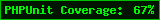

# PHP Test Coverage Image from Github Actions

Demonstration of a PHPUnit code coverage report, in image form, published back to the repo and linked in the readme.

## Code Coverage

This repo has PHPUnit code coverage of:

## Notes

The example code is pretty contrived. The combination of code in the repo is just made very simple
so that a mix of covered and uncovered code by unit tests could be measured.
